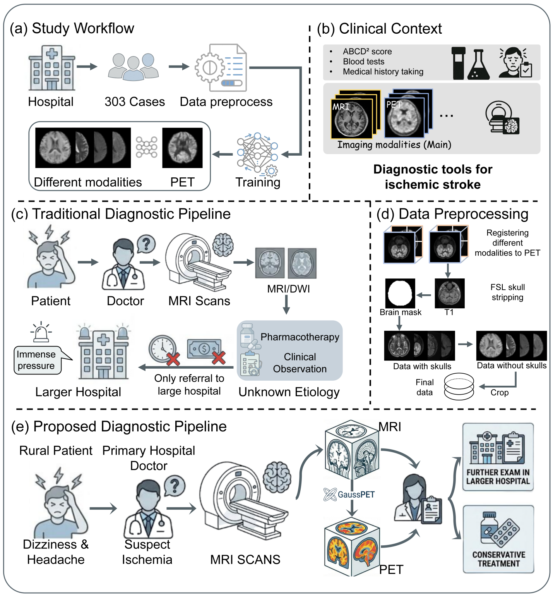
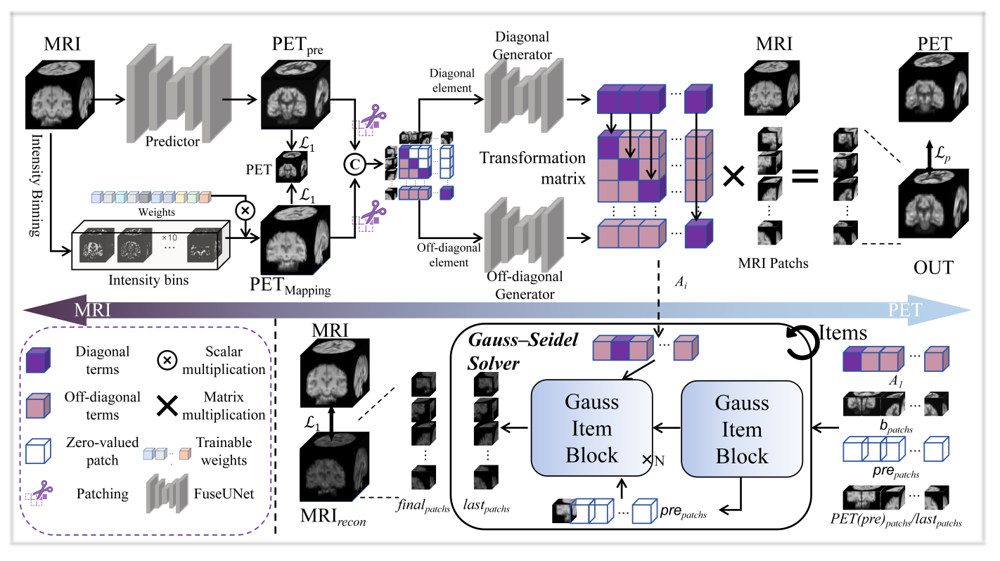
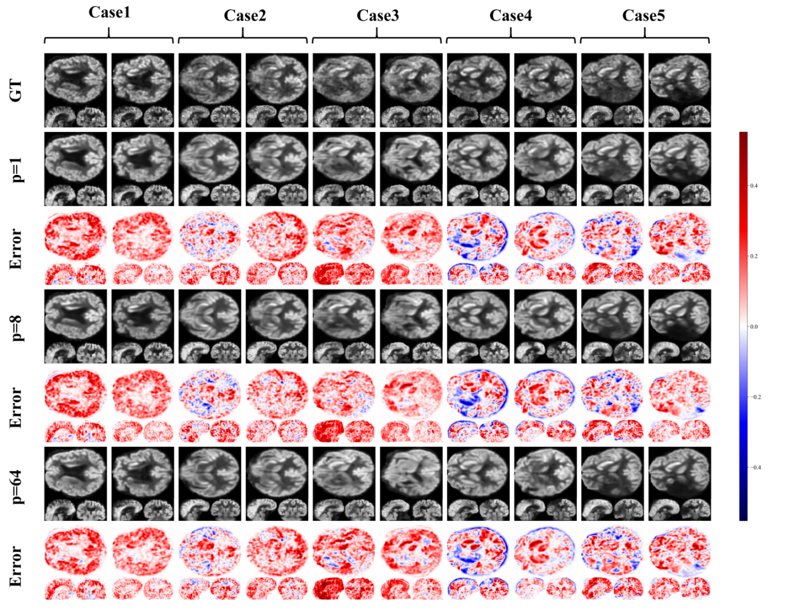

# GaussPET

📝Accurate evaluation of cerebral ischemia relies on metabolic imaging, yet positron emission tomography (PET) is rarely available in primary and resource-limited hospitals due to its cost, radiation exposure, and operational complexity. In such settings, diagnosis predominantly depends on magnetic resonance imaging (MRI), which primarily reflects structural changes and often fails to reveal early or subtle metabolic abnormalities, leading to diagnostic uncertainty and delayed clinical decision-making. We propose GaussPET, an interpretable MRI-to-PET synthesis framework designed to provide PET-equivalent metabolic information from routine MRI alone. Instead of modeling cross-modal translation as a highly nonlinear black-box process, GaussPET is grounded in the observation that local intensity variations between MRI and PET exhibit stable, physiologically meaningful linear relationships. MRI-to-PET generation is therefore formulated as a structured linear transformation, complemented by a Gauss–Seidel iterative scheme that enforces bidirectional consistency through auxiliary PET-to-MRI reconstruction, enhancing numerical stability and metabolic plausibility. Experiments on 303 patients with cerebral ischemia show that GaussPET consistently outperforms state-of-the-art generative methods across multiple quantitative metrics. Regional analyses across nine cerebral vascular territories demonstrate strong agreement with real PET, while hypometabolic region derived from synthesized PET preserve clinically relevant correlations with NIHSS and mRS scores. By enabling noninvasive metabolic assessment without additional scanning time or radioactive tracers, GaussPET offers a practical solution to the functional imaging gap in primary hospitals, supporting more reliable ischemia evaluation in resource-constrained clinical environments.


# ✨ Overall study overview

Overall study overview. (a) The proposed research pipeline: data acquisition from 303 hospital patients, followed by preprocessing and downstream analyses. (b) Conventional diagnostic modalities for cerebral ischemia, including blood tests, text-based evaluation, and imaging. (c) Current diagnostic workflow in primary hospitals, where inter-hospital referral may delay treatment and increase expenses due to redundant examinations. (d) Preprocessing procedures, including registration, skull stripping, and cropping. (e) The anticipated primary-hospital diagnostic workflow after integrating the proposed approach.

# ✨ Overall framework of the model

Overview of the proposed model. The model comprises a primary forward pathway for MRI-to-PET synthesis and an auxiliary inverse pathway for PET-to-MRI reconstruction, where the latter serves as a regularizer to encourage the forward synthesis to retain MRI-consistent physiological structures.

#🔧How to use
## 🔧 Environment
Please prepare an environment with Python 3.11, and then use the command "pip install -r requirements.txt" for the dependencies:
```
conda create -n GaussPET python=3.11 -y
conda activate GaussPET
pip install -r requirements.txt
```
## 🔧 Data Preparation
For training with custom data, the dataset should be preprocessed and organized following the structure shown below, in which MRI represents different MRI modalities. MRI and PET images are expected to be spatially aligned, and the MRI file names should match the modality settings defined in the main script.
```
Dataset
├─ train
│  ├─ MRI
│  │  ├─ 0.nii.gz
│  │  ├─ 1.nii.gz
│  │  └─ ...
│  └─ PET
│     ├─ 0.nii.gz
│     ├─ 1.nii.gz
│     └─ ...
└─ test
   ├─ MRI
   │  ├─ 0.nii.gz
   │  ├─ 1.nii.gz
   │  └─ ...
   └─ PET
      ├─ 0.nii.gz
      ├─ 1.nii.gz
      └─ ...
```
## 🔧 Experiment Settings
You can directly configure the hyperparameters, data path, and save path in main.py. Other settings, such as the directories for saving model outputs, are not individually exposed for easy tuning in main.py, but they remain easy to modify with minimal effort.


# 🚀 Results
## ⚡ Visual comparison

Qualitative results under varying patch numbers. Five longitudinal cases are presented, showing the generated PET images and absolute error maps with respect to the ground-truth PET. Each case corresponds to one patient with two scans acquired at different time points. The proposed method maintains consistently high synthesis fidelity across different patch configurations.

📄Quantitative evaluation of our approach under varying patch numbers. We compare the metric values across different patch configurations and report the associated 95% confidence intervals (95% CI) over five metrics.
<table border="1">
  <thead>
    <tr>
      <th rowspan="2">Number of patches</th>
      <th colspan="5" style="text-align:center">Metrics</th>
    </tr>
    <tr>
      <th>PSNR ↑</th>
      <th>SSIM ↑</th>
      <th>NMAE ↓</th>
      <th>NMSE ↓</th>
      <th>NCC ↑</th>
    </tr>
  </thead>
  <tbody>
    <tr>
      <td>1</td>
      <td>30.2762</td>
      <td>0.9576</td>
      <td>0.18</td>
      <td>0.0452</td>
      <td>0.9795</td>
    </tr>
    <tr>
      <td>[95% CI]</td>
      <td>[29.7941, 30.7584]</td>
      <td>[0.9472, 0.9574]</td>
      <td>[0.1673, 0.1927]</td>
      <td>[0.0388, 0.0519]</td>
      <td>[0.9772, 0.9817]</td>
    </tr>
    <tr>
      <td>8</td>
      <td>30.5312</td>
      <td>0.9602</td>
      <td>0.1754</td>
      <td>0.0431</td>
      <td>0.9808</td>
    </tr>
    <tr>
      <td>[95% CI]</td>
      <td>[30.0391, 31.0233]</td>
      <td>[0.9507, 0.9603]</td>
      <td>[0.1625, 0.1883]</td>
      <td>[0.0368, 0.0494]</td>
      <td>[0.9786, 0.9830]</td>
    </tr>
    <tr>
      <td>64</td>
      <td>30.2591</td>
      <td>0.9572</td>
      <td>0.1819</td>
      <td>0.0457</td>
      <td>0.9774</td>
    </tr>
    <tr>
      <td>[95% CI]</td>
      <td>[29.3399, 30.3042]</td>
      <td>[0.9433, 0.9535]</td>
      <td>[0.1764, 0.2016]</td>
      <td>[0.0433, 0.0562]</td>
      <td>[0.9750, 0.9798]</td>
    </tr>
  </tbody>
</table>

📄Quantitative comparison of our approach against baseline methods over five evaluation metrics. We report the performance scores, the pairwise statistical significance tests with our method as the reference (all p < 0.001), and the corresponding 95% confidence intervals (95% CI) for each metric.

<table border="1">
  <thead>
    <tr>
      <th rowspan="2">Method</th>
      <th colspan="2">PSNR</th>
      <th colspan="2">SSIM</th>
      <th colspan="2">NMAE</th>
      <th colspan="2">NMSE</th>
      <th colspan="2">NCC</th>
    </tr>
    <tr>
      <th>value</th>
      <th>p-value</th>
      <th>value</th>
      <th>p-value</th>
      <th>value</th>
      <th>p-value</th>
      <th>value</th>
      <th>p-value</th>
      <th>value</th>
      <th>p-value</th>
    </tr>
  </thead>
  <tbody>
    <tr>
      <td>CycleGAN</td>
      <td>18.1074</td>
      <td>p&lt;0.001</td>
      <td>0.7918</td>
      <td>p&lt;0.001</td>
      <td>0.7628</td>
      <td>p&lt;0.001</td>
      <td>0.6666</td>
      <td>p&lt;0.001</td>
      <td>0.5705</td>
      <td>p&lt;0.001</td>
    </tr>
    <tr>
      <td>95% CI</td>
      <td colspan="2">[17.9504, 18.2644]</td>
      <td colspan="2">[0.7862, 0.7974]</td>
      <td colspan="2">[0.7505, 0.7750]</td>
      <td colspan="2">[0.6442, 0.6890]</td>
      <td colspan="2">[0.5658, 0.5752]</td>
    </tr>
    <tr>
      <td>pixel2pixel</td>
      <td>26.7046</td>
      <td>p&lt;0.001</td>
      <td>0.9247</td>
      <td>p&lt;0.001</td>
      <td>0.2784</td>
      <td>p&lt;0.001</td>
      <td>0.1099</td>
      <td>p&lt;0.001</td>
      <td>0.9640</td>
      <td>p&lt;0.001</td>
    </tr>
    <tr>
      <td>95% CI</td>
      <td colspan="2">[26.3142, 27.0950]</td>
      <td colspan="2">[0.9198, 0.9295]</td>
      <td colspan="2">[0.2516, 0.3052]</td>
      <td colspan="2">[0.0850, 0.1347]</td>
      <td colspan="2">[0.9614, 0.9665]</td>
    </tr>
    <tr>
      <td>PASTA</td>
      <td>25.9697</td>
      <td>p&lt;0.001</td>
      <td>0.9074</td>
      <td>p&lt;0.001</td>
      <td>0.2884</td>
      <td>p&lt;0.001</td>
      <td>0.1125</td>
      <td>p&lt;0.001</td>
      <td>0.9399</td>
      <td>p&lt;0.001</td>
    </tr>
    <tr>
      <td>95% CI</td>
      <td colspan="2">[25.6626, 26.2769]</td>
      <td colspan="2">[0.9025, 0.9122]</td>
      <td colspan="2">[0.2762, 0.3006]</td>
      <td colspan="2">[0.1041, 0.1209]</td>
      <td colspan="2">[0.9357, 0.9440]</td>
    </tr>
    <tr>
      <td>IL-CLDM</td>
      <td>21.3346</td>
      <td>p&lt;0.001</td>
      <td>0.8232</td>
      <td>p&lt;0.001</td>
      <td>0.5083</td>
      <td>p&lt;0.001</td>
      <td>0.3313</td>
      <td>p&lt;0.001</td>
      <td>0.9280</td>
      <td>p&lt;0.001</td>
    </tr>
    <tr>
      <td>95% CI</td>
      <td colspan="2">[24.5891, 24.9638]</td>
      <td colspan="2">[0.8744, 0.8842]</td>
      <td colspan="2">[0.3186, 0.3555]</td>
      <td colspan="2">[0.1344, 0.1700]</td>
      <td colspan="2">[0.9246, 0.9315]</td>
    </tr>
    <tr>
      <td>FuseUNet</td>
      <td>29.2902</td>
      <td>p&lt;0.001</td>
      <td>0.9412</td>
      <td>p&lt;0.001</td>
      <td>0.2022</td>
      <td>p&lt;0.001</td>
      <td>0.0541</td>
      <td>p&lt;0.001</td>
      <td>0.9742</td>
      <td>p&lt;0.001</td>
    </tr>
    <tr>
      <td>95% CI</td>
      <td colspan="2">[28.9007, 29.6797]</td>
      <td colspan="2">[0.9368, 0.9456]</td>
      <td colspan="2">[0.1914, 0.2131]</td>
      <td colspan="2">[0.0488, 0.0594]</td>
      <td colspan="2">[0.9720, 0.9764]</td>
    </tr>
    <tr>
      <td>OUR</td>
      <td>30.5312</td>
      <td>NA</td>
      <td>0.9602</td>
      <td>NA</td>
      <td>0.1754</td>
      <td>NA</td>
      <td>0.0431</td>
      <td>NA</td>
      <td>0.9808</td>
      <td>NA</td>
    </tr>
    <tr>
      <td>95% CI</td>
      <td colspan="2">[30.0391, 31.0233]</td>
      <td colspan="2">[0.9507, 0.9603]</td>
      <td colspan="2">[0.1625, 0.1883]</td>
      <td colspan="2">[0.0368, 0.0494]</td>
      <td colspan="2">[0.9786, 0.9830]</td>
    </tr>
  </tbody>
</table>


